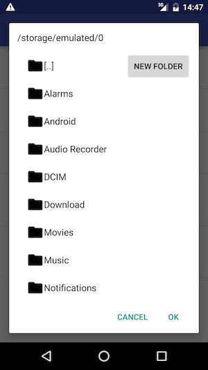
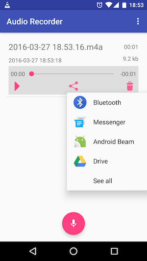
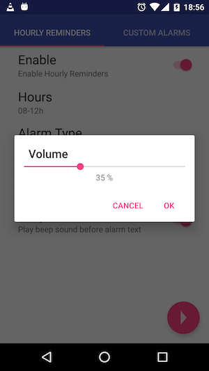
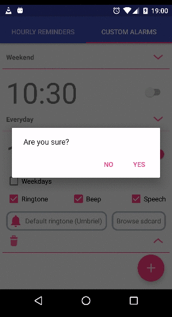
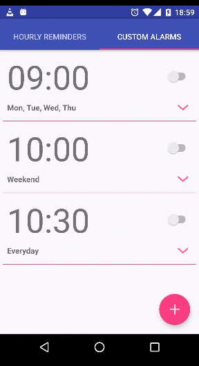
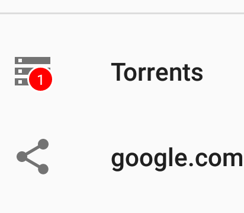

# android-library

Android Widgets and Support Class Library

# Class List

* [OpenFileDialog.java](./src/main/java/com/github/topol777/androidlibrary/widgets/OpenFileDialog.java)

Android Directory / File Choicer Dialog with options to create / rename / delete file.



* [PopupShareActionProvider.java](./src/main/java/com/github/topol777/androidlibrary/widgets/PopupShareActionProvider.java)



* [SeekBarPreference.java](./src/main/java/com/github/topol777/androidlibrary/widgets/SeekBarPreference.java)



Expandable List View

* [RemoveItemAnimation.java](./src/main/java/com/github/topol777/androidlibrary/animations/RemoveItemAnimation.java)



* [MarginAnimation.java](./src/main/java/com/github/topol777/androidlibrary/animations/MarginAnimation.java)



WebViewCustom

* [WebViewCustom.java](./src/main/java/com/github/topol777/androidlibrary/widgets/WebViewCustom.java)

Support Apache HttpClient, Proxying...

* [UnreadCountDrawable.java](./src/main/java/com/github/topol777/androidlibrary/widgets/UnreadCountDrawable.java)

Unread Count Drawable



# Install

## gradle

```gradle
    compile 'topol777:android-library:1.35.5'
```

## maven

```xml

<dependency>
    <groupId>topol777com.github.topol777</groupId>
    <artifactId>android-library</artifactId>
    <version>1.35.5</version>
    <type>aar</type>
</dependency>
```
